Seraphs: NaNoGenMo2014
=============

Generate a 50,000+ word "book" based on the Voynich Manuscript. Uses the following resources:

* The Flickr API and Internet Archive Commons account to grab 18th century images based on specific themes like "biology" and "alchemy."
* Processes the resulting illustrations to match background colors and discard undesirable images.
* Uses a randomized corpus of the original Voynich Manuscript (from the EVA transcription) remapped to a public domain Voynich-like font.
* Generates a set of themed "folios" based on the themes from the original manuscript.
* Converts the output using CSS3 paged media to print-ready PDF (requires a local installation of Prince XML).

The source code in this repository is in the public domain. Note that a mix of commercial and closed-source software is necessary to generate the final output.

Book version
------------

A hand-curated book version is available as <a href="https://github.com/lizadaly/nanogenmo2014/raw/master/seraphs.pdf">seraphs.pdf</a>, or a fully laid out book is available for purchase at cost <a href="http://www.blurb.com/b/5921004-seraphs">from Blurb</a>.

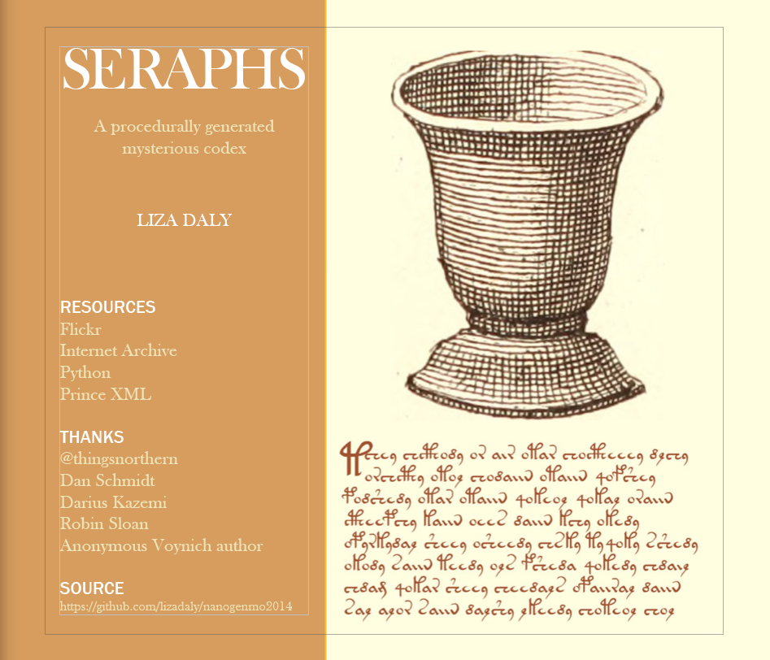

Installation
------------

Set up a virtual environment:

```
virtualenv ve
````

Ensure that you have various image libraries installed (for OS X users, `brew install libjpeg` and `brew install libpng`).

Install the dependencies:

```
. ve/bin/activate
python setup.py develop
```

Get a Flickr API key and add it to a directory called `secret`:

```
mkdir secret
cat "FLICKR_KEY = 'YOUR-KEY-HERE'" > secret/__init__.py
cat "FLICKR_SECRET = 'YOUR-SECRET-HERE'" >> secret/__init__.py
```

Install PrinceXML (http://princexml.com/) locally.

Run the program:

```
python seraphs/generate.py
```

The program should go off and acquire a _lot_ of images from Flickr, randomize them, and generate a PDF somewhere in the 400-page range.

Once it runs, it will cache the resulting images (as local pickle files) in `seraphs/cache` and pull a random set from those. Delete that directory to re-acquire the assets from Flickr.

The output will be `seraphs/build/book.pdf`. It will be _very large_ (more than 1 gigabyte).

Example output
==============

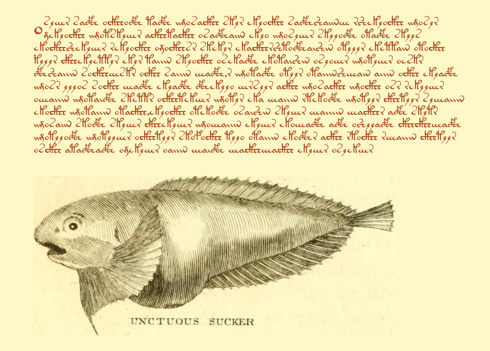
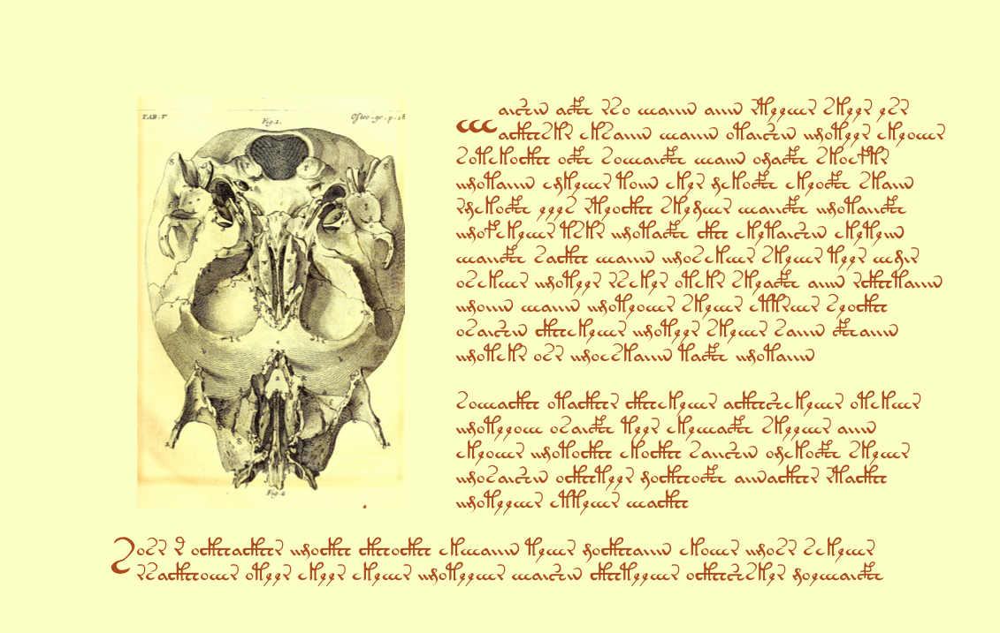
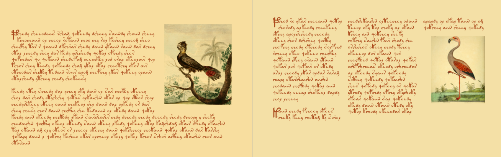
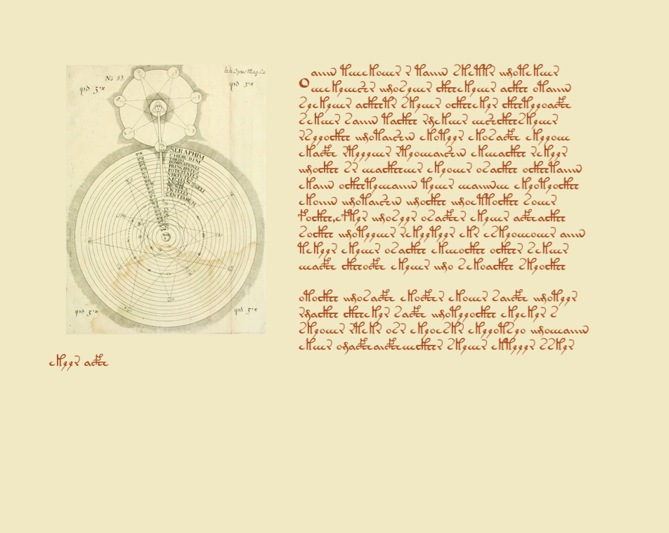
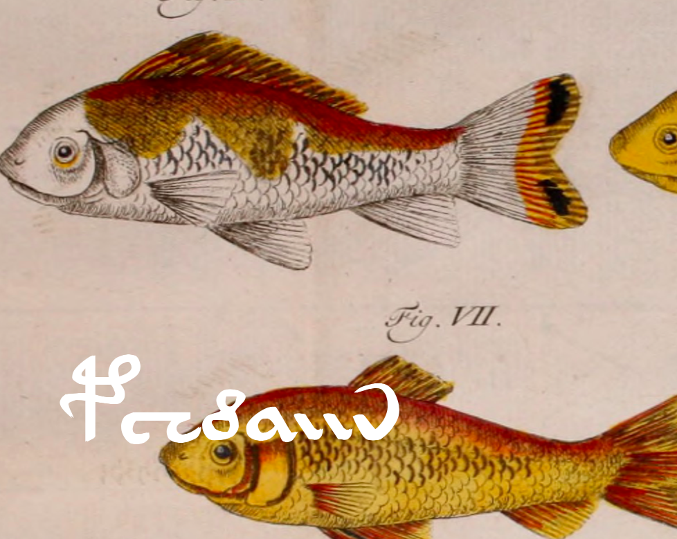
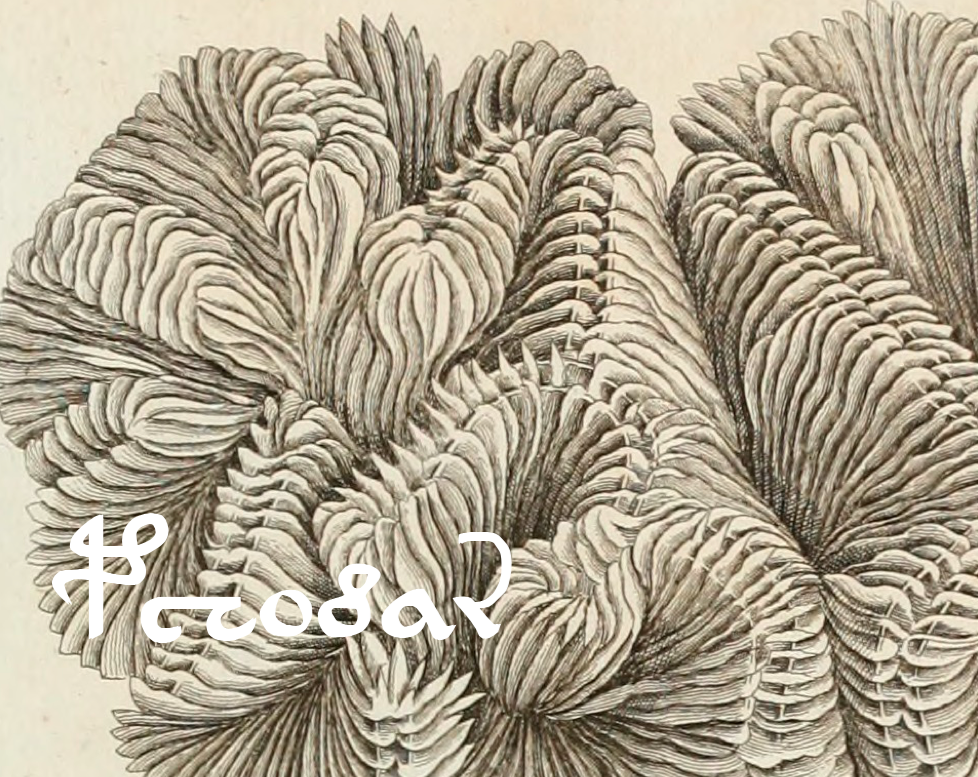
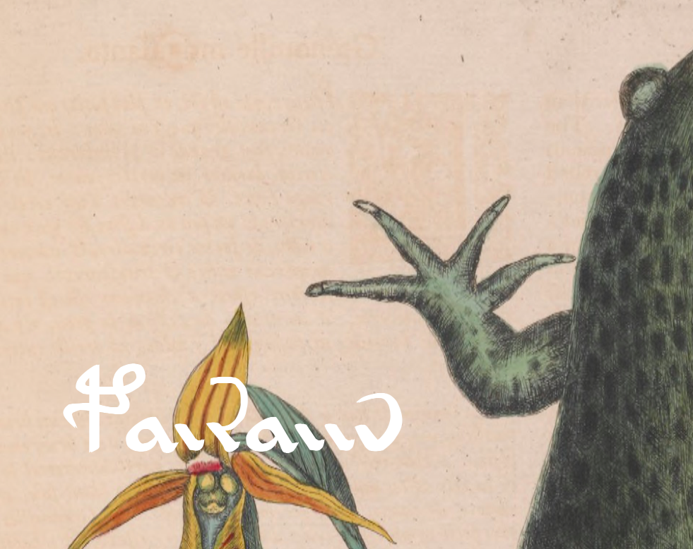
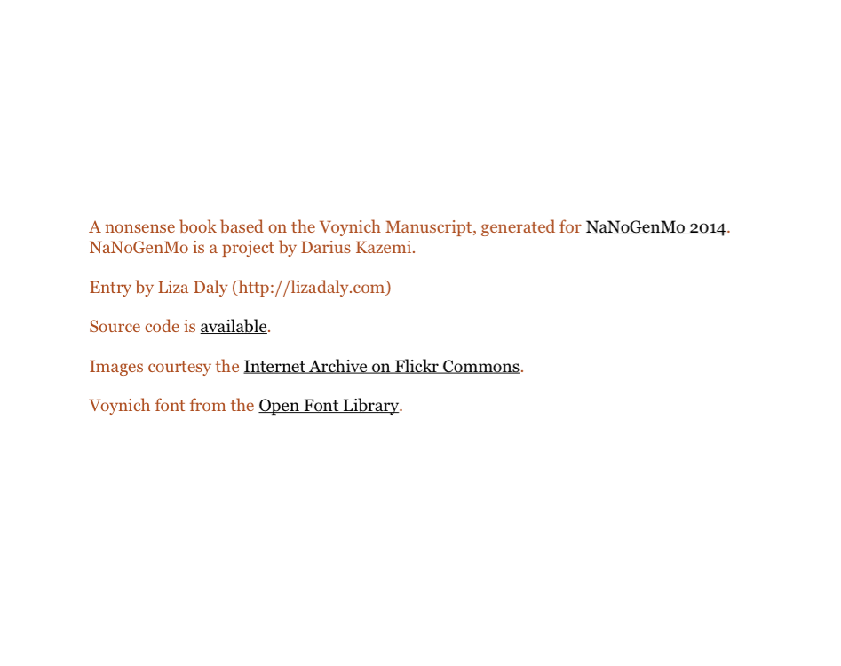
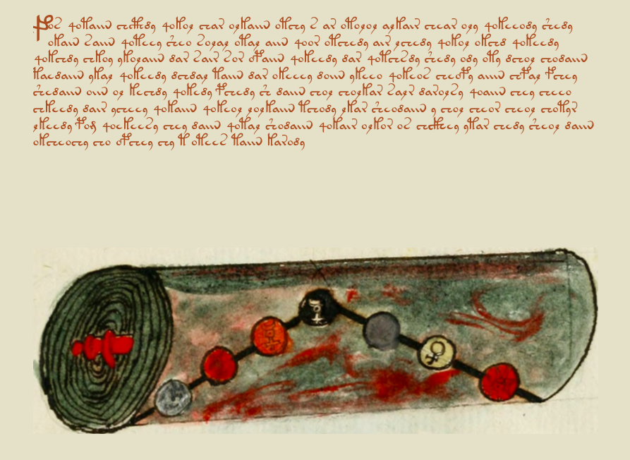
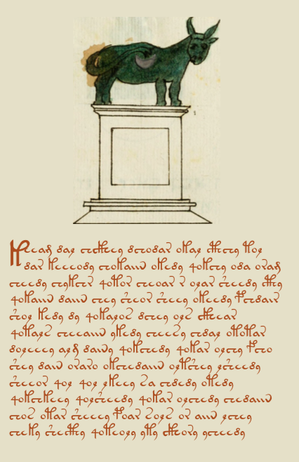
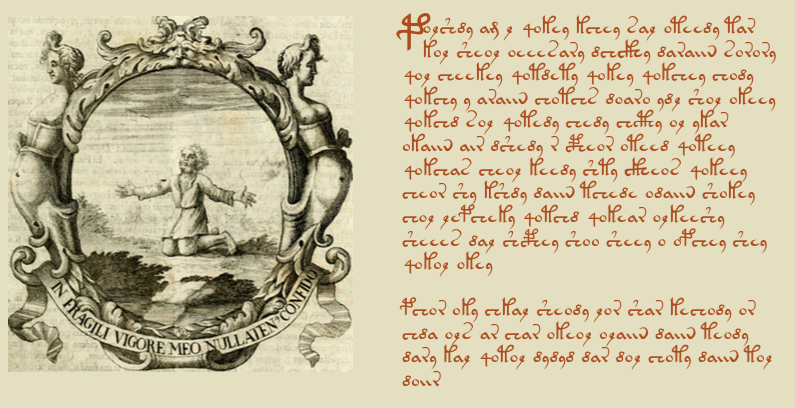
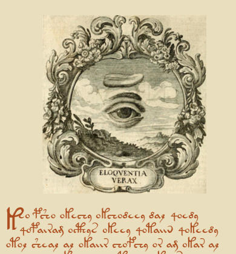
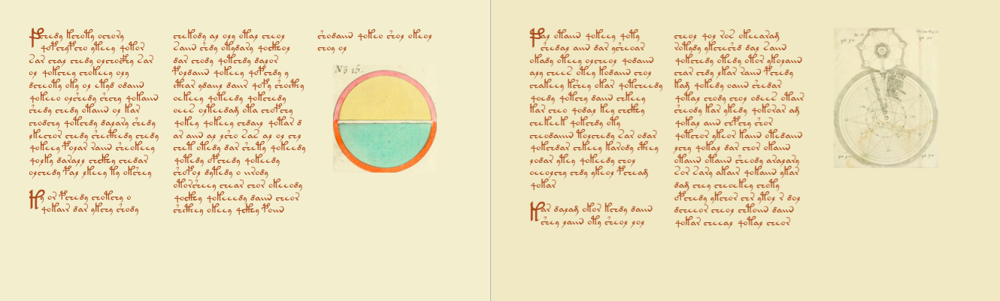
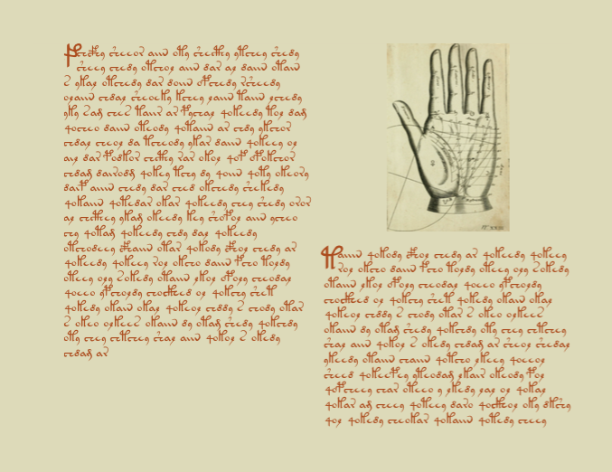
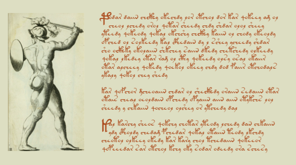
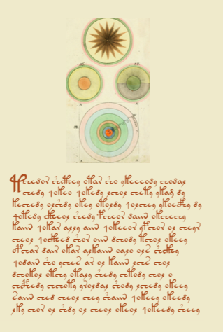


